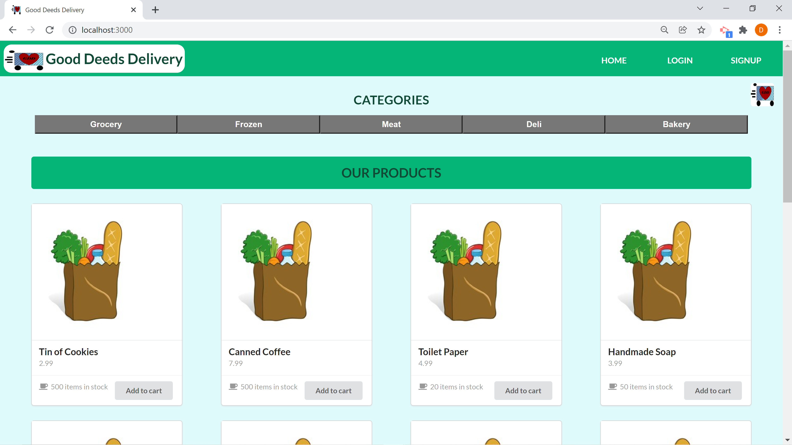
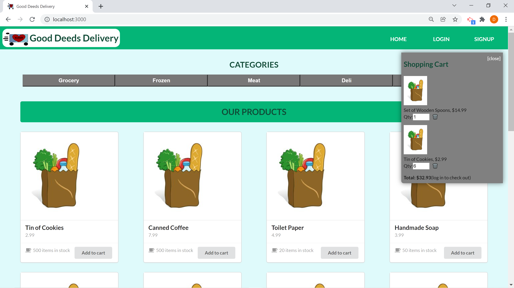
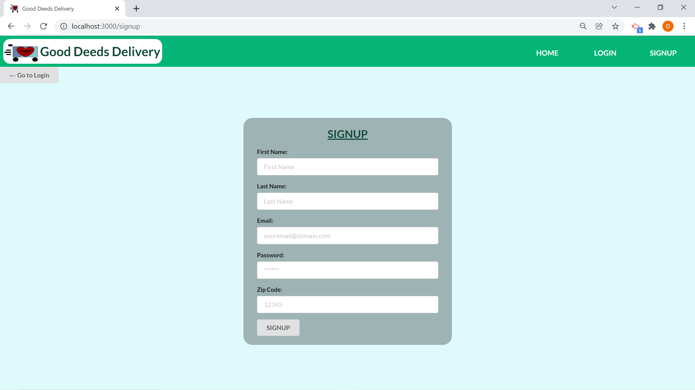
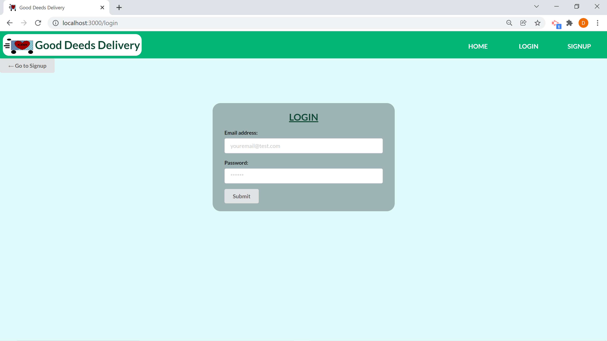
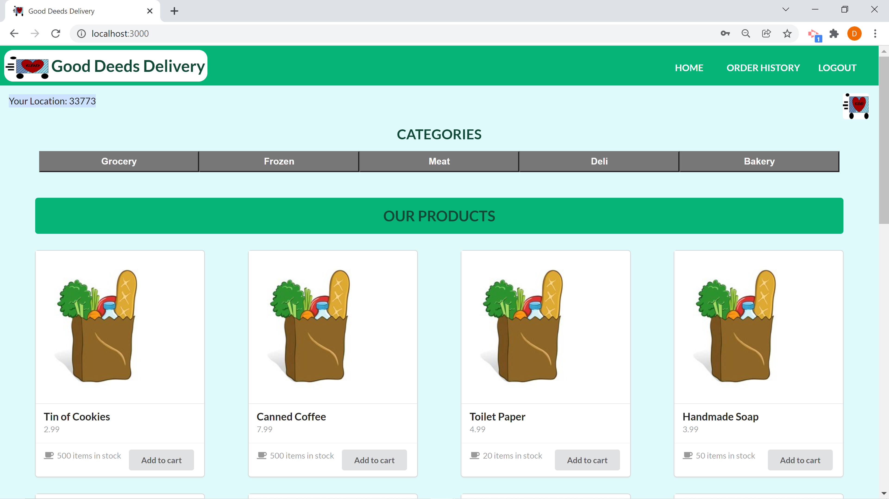
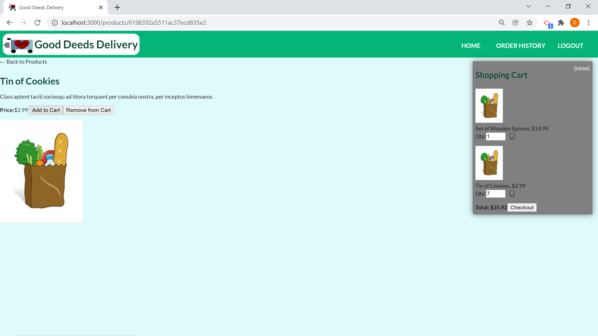
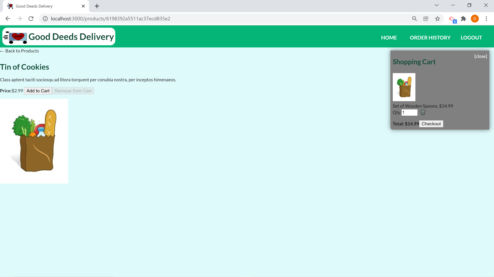
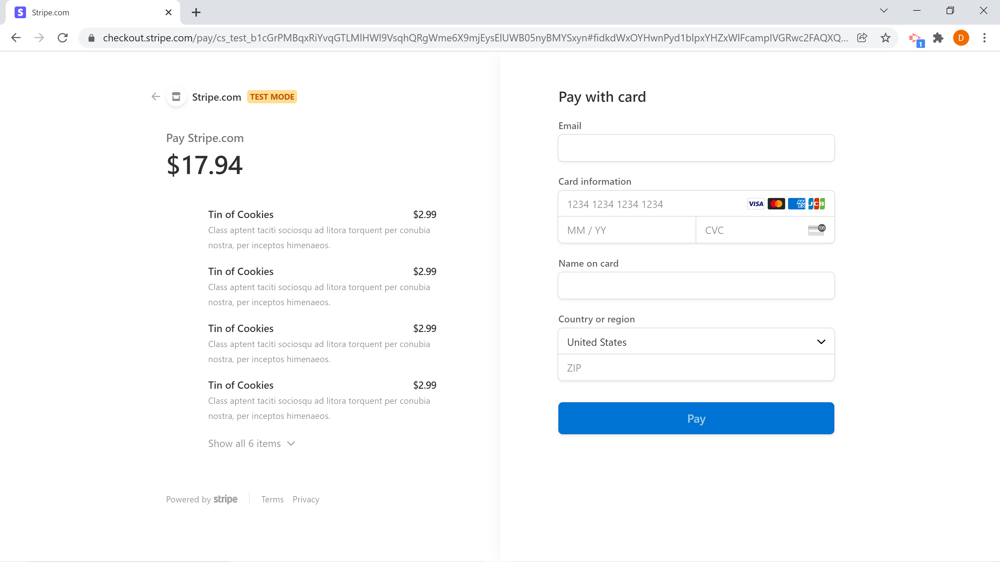
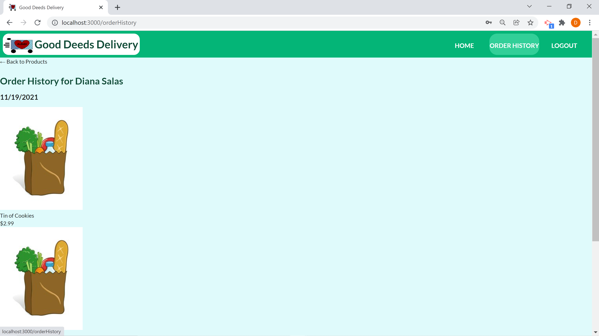

# Good Deeds Deliver App


## User Story

As someone who has a difficult time leaving the house to get groceries, I have to use grocery delivery often. Having a fixed income makes it hard to afford other items I need when having to pay a lot in delivery fees. I would like an application that would allow someone to volunteer to deliver my grocery pick up orders to save on delivery fees.

# Description

This application was created to help the elderly and disabled save on delivery fees by having someone in their community volunteer to pick up their grocery orders for them. Both the user and volunteer create an account to access the services. When a user is signed in, they can see available grocery items, add them to their cart, and checkout using Stripe. Their order is then added to a map, and a signed in volunteer can see available delivery orders near them. When they click on a map marker, they can see the user's contact information to confirm delivery location, what the order contains, and where the order will be picked up. This application uses the MERN SPA development stack for the frontend and backend.


## Table of Contents

* [Mock-Up](#mock-up)

* [Built-With](#built-with)

* [Installation](#installation)

* [Usage](#usage)

* [License](#license)

* [Contributing](#contributing)

* [Questions](#questions)

* [Deployed](#deployed)

* [Repository](#repository)


## Mock-Up












## Built-With

ReactJS, Node.js, Express.js, MongoDB, Mongoose, JavaScript, bcrypt, custom CSS styled components, CSS, Semantic UI, Google Maps API


## Installation

To install necessary dependencies: 
- Clone this reposity on your local machine
- Create your .env file in the root directory of the server
- Run the following in your terminal:
```md
cd "the root directory"
npm install
```

## Usage

To use this application, run the following commands:
```md
npm run seed
npm run develop
```

## License

This project is licensed under the GNU GPLv3 license.


## Contributing

Please contact the owner of the repository if you would like to contribute.


## Questions

If you have any questions about the repo, open an issue or contact me directly at salasd10418@gmail.com. You can find more of my work at [Github](https://github.com/salasd93).


## Deployed

https://good-deeds-delivery.herokuapp.com/


## Repository

https://github.com/SalasD93/good-deeds-delivery